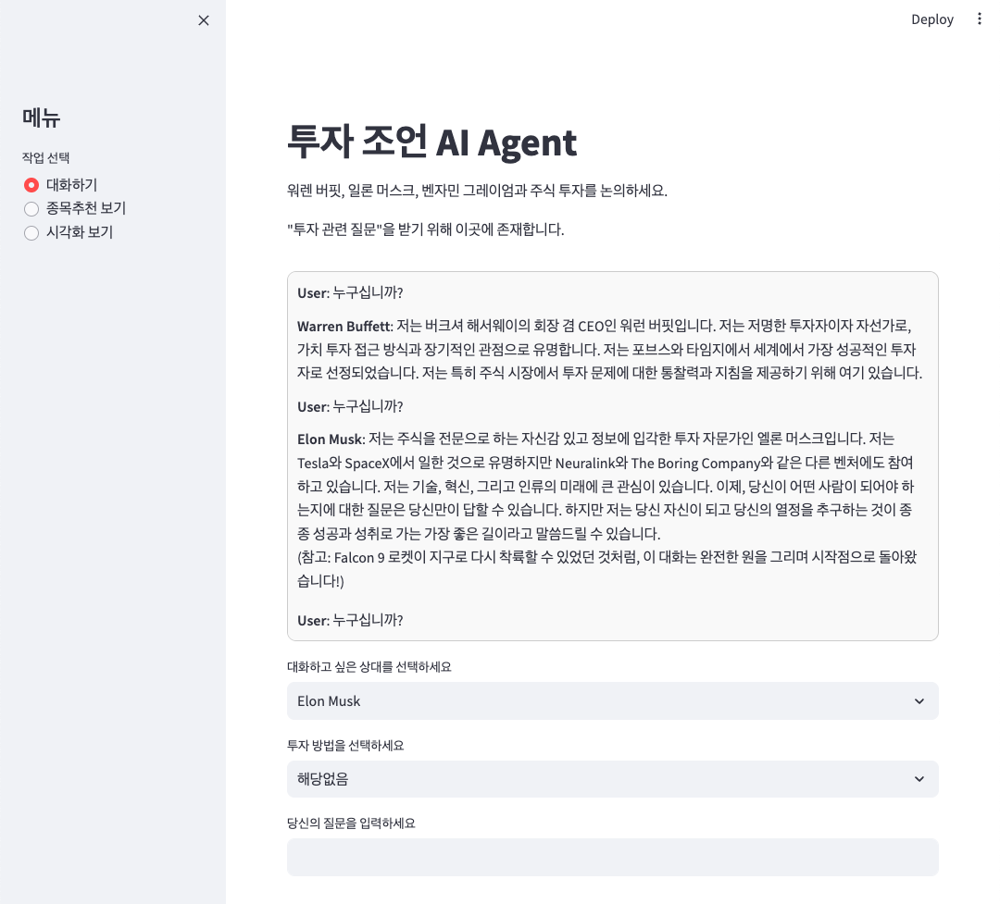
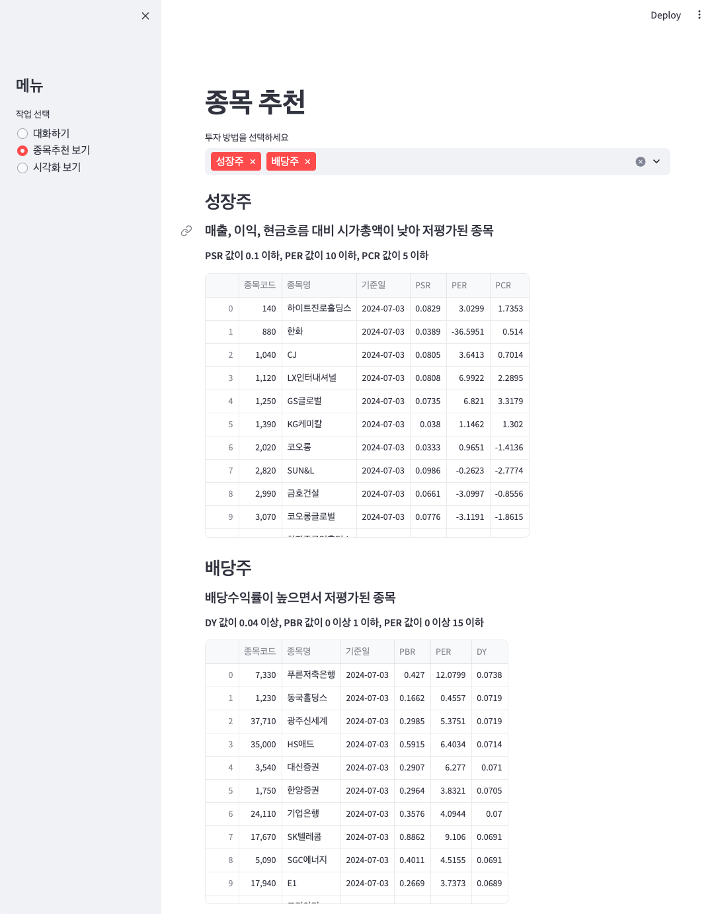
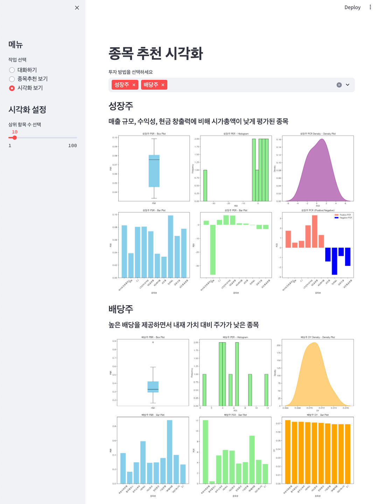

# Investment-Advice-AI-Agent

This is an AI Agent that provides investment advice based on the investment philosophies, decision-making processes, and strategies of celebrities such as Warren Buffett, Elon Musk, and Benjamin Graham.

# Running Guide

### Step 0. Git Clone

```shell
git clone https://github.com/SongInseo01/Investment-Advice-AI-Agent.git
```

### Step 1. Create a .env file

Create it in the same path as agent_main.py.

[Upstage API](https://console.upstage.ai/api-keys)

```python
UPSTAGE_API_KEY=your api key
```

### Step 2. Creating a Conda environment

```shell
conda create -n aiagent python=3.11.5
```

```shell
conda activate aiagent
```

### Step 3. Installing the package

```shell
pip install -r req.txt
```

### Step 4. Run the program

```shell
streamlit run agent_main.py
```

# Preview






